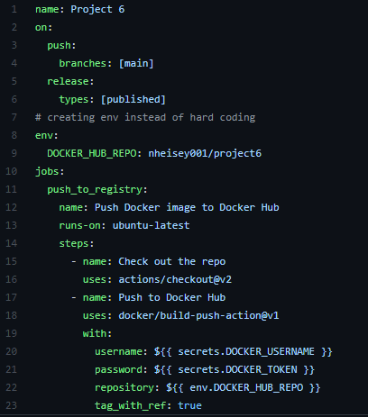

# Project 6

# Part 1  
- Project Overview  
- Run Project Locally  
  - how you installed docker + dependencies (WSL2, for example)  
	I installed docker on an ec2 instance I already had running by using the command: sudo snap install docker
	Created the Dockerfile and a basic html file.
  - how to build the container
	To build the container I ran this command: sudo docker build -t website:latest .
  - how to run the container  
	To run the container I ran the command: sudo docker run -dit -p 8080:80 website
  - how to view the project (open a browser...go to ip and port...)  
	To view the project on my browser I typed this into the searchbar: 54.174.1.237:8080

## Part 2  
- Create DockerHub public repo
  - process to create  
	To create my DockerHub repo I git the create button and gave it the name 'project6' and made it public.
- Allow DockerHub authentication via CLI using Dockhub credentials  
	To access my DockerHub account in my EC2 instance I entered the command: sudo docker login --username nheisey001 then entered my password.  
	Once that step was done I used the command: sudo docker push nheisey001/project6:website to actually add the files needed to it.
- Configure GitHub Secrets  
	I created two new repository secrets one named DOCKER_USERNAME and the other named DOCKER_TOKEN
  - what credentials are needed - DockerHub credentials (do not state your credentials)  
	Both my user name and password to my DockerHub account were needed
  - set secrets and secret names  
	My DOCKER_USERNAME contains the Username and DOCKER_TOKEN contains my password
- Configure GitHub Workflow  
  - variables to change (repository, etc.)  
  
	I kept most of the file the same as the one in the project repo the main changes include: different name, added on push so it knows to run this workflow when I push my repo  
	changed the Docker hub repo name to what my repo's name was, and changed the password secret name from DOCKER_PASSWORD to DOCKER_TOKEN because that is what I named it. That is   
	essentially every change I made. This part by far took the longest, around two hours and 25 commits later I kept trying to fix the issue with the workflow file because whenever it  
	tried to run it would tell me it could not find the Dockerfile, I eventually realized it was because I believe I had messed with something originally that removed all of the files  
	from my Github repo and I simply forgot to add them back.
	

## Part 3  
- Pulling the image
 To pull the image I used this command: sudo docker pull nheisey001/project6:main  
- Running the container  
To run the container I used this command: sudo docker run -dit -p 8080:80 nheisey001/project6:main  
